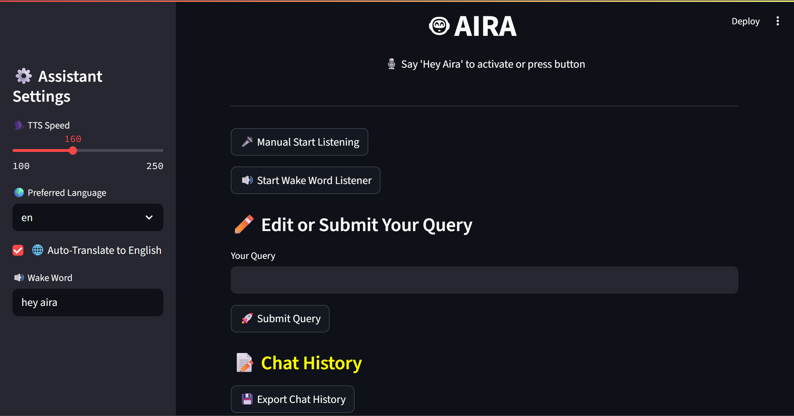

<p align="center">
  
</p>
<h1 align="center">🤖 AIRA – AI Responsive Assistant</h1>
<p align="center">Your multilingual voice assistant with DeepSeek + LangChain + Streamlit</p>


**AIRA** is a fully customizable, multilingual AI-powered voice assistant built with cutting-edge technologies like `Streamlit`, `LangChain`, `Ollama`, and `Vosk`. It understands your voice commands, performs smart actions, and responds intelligently — all while maintaining conversation history and providing a pleasant, human-like interaction.

Whether you're looking to automate daily tasks, interact with an AI agent using natural voice input, or experiment with multilingual voice-to-AI pipelines, **AIRA** offers a powerful yet beginner-friendly platform to do it all.

---


## ✨ Key Features

| Feature                              | Description                                                                 |
|--------------------------------------|-----------------------------------------------------------------------------|
| 🗣️ Wake Word Detection               | Say "**Hey Aira**" (customizable) to activate the assistant hands-free     |
| 🎤 Speech-to-Text                    | Uses **Vosk** for accurate offline voice transcription                     |
| 🌐 Multilingual Support              | Accepts voice input in **English, Hindi, Kannada, Malayalam, Telugu, Tamil** with auto-translation to English |
| 🤖 LLM Integration                   | Uses **Ollama + DeepSeek-R1:8B model** via LangChain for intelligent responses |
| 🔄 Conversation Memory               | Tracks dialogue context using LangChain's `ChatMessageHistory`             |
| 🔊 Text-to-Speech                    | Speaks responses aloud using `pyttsx3`, with adjustable speed              |
| 🧠 Smart System Actions              | Executes commands like "open YouTube", "what's the time?", "shutdown", etc. |
| ✍️ Manual Query Support              | Allows typed input in addition to voice input                              |
| 📁 Chat History Export               | Saves entire conversation with timestamp to a `.txt` file                  |
| 🧩 Modular, Extensible Codebase      | Easy to plug in new models, UI customizations, or extra voice features     |

---

## 📂 Project Structure

AIRA/
├── models/
│ └── vosk-model-small-en-us-0.15/ # Required for offline speech recognition and can change according to requirement
├── main.py # Main Streamlit app with AI assistant logic
├── requirements.txt # Dependency list
└── README.md # Project documentation


---



---


## 🧠 How It Works — `main.py` Explained

### 🔧 Initialization & Setup

- Loads **Streamlit UI** and sidebar for configuration (TTS speed, language, wake word, etc.)
- Initializes **text-to-speech (TTS)** engine using `pyttsx3`
- Loads **Vosk offline speech recognition model** from `/models`
- Sets up **LangChain with Ollama** using the `deepseek-r1:8b` model (streaming mode)
- Maintains **chat history** across queries using `ChatMessageHistory`

---

### 🗣️ Voice Interaction Flow

1. **Wake Word Detection**  
   Listens in the background for a user-defined trigger (default: `"hey aira"`). Once detected, it records your voice.

2. **Speech Transcription & Translation**  
   Uses **Vosk** to transcribe speech. If a non-English language is selected, it uses `deep_translator` to translate to English (before sending to the AI model).

3. **AI Response Generation**  
   The input (voice or text) is passed into a **prompt template** that includes conversation history. `LangChain` formats the prompt and sends it to **DeepSeek-R1:8B** via **Ollama**, and returns a streamed response.

4. **Response Handling**  
   The AI’s answer is:
   - Spoken aloud using `pyttsx3`
   - Displayed on the UI
   - Stored in the session’s history

---

### 🔄 Action Handler

Handles system-level commands like:
- `"open YouTube"`, `"open Gmail"`, `"search for cats"`
- `"shutdown"`, `"restart"`, `"what time is it?"`, `"open calculator"`
- You can expand this easily in the `handle_actions()` function

---

### ✍️ Manual Input Support

In case your mic doesn't work or you prefer typing, AIRA provides:
- A text box to manually enter a query
- A "Submit Query" button that processes it like a voice command

---

### 💬 Chat Management

- Each message is stored using `ChatMessageHistory` (type: user/AI)
- On-screen chat history with emojis
- "Export Chat" button saves conversation to a `.txt` file with a timestamp

---

## ⚙️ Installation & Setup

### 🔗 1. Clone the Repo

```bash
git clone https://github.com/<your-username>/aira.git
cd aira
```

---

### 📦 2. Install Dependencies

```bash
pip install -r requirements.txt
```

---

### 💡 3. Set Up Vosk Model
Download from: https://alphacephei.com/vosk/models

Place the model folder like this:

```bash
AIRA/models/vosk-model-small-en-us-0.15/
```

---

### 🤖 4. Pull Ollama Model
Ensure you have Ollama installed. Then run:

```bash
ollama pull deepseek-r1:8b
```

---

### 🏁 5. Run the Assistant

```bash
streamlit run main.py
```

---

🌐 Language Support
Your voice input can be in:

Language	Code
English	    en
Hindi	    hi
Kannada	    kn
Malayalam	ml
Telugu	    te
Tamil	    ta

Transcription is translated to English (if enabled) for best LLM response quality.

---

### 🔐 Dependencies
Here’s a sample requirements.txt:
```bash
~streamlit
~sounddevice
~vosk
~pyttsx3
~numpy
~deep-translator
~langchain
~langchain-community
~langchain-core
~langchain-ollama
```
You can generate exact versions with pip freeze > requirements.txt.

---

### 🧩 Extending the Assistant

You can enhance AIRA by:

=> Adding custom actions like controlling IoT devices

=> Integrating camera/image recognition

=> Switching models (e.g., LLaMA 3, Phi-3) using Ollama

=> Using OpenAI API instead of Ollama

=> Deploying on a server with wake-word listener running in background

=> Using a higher upgrade vsok model for a greater accuracy

---

### 👨‍💻 Author
Sumukh Mallikarjuna
Passionate about AI, LLMs, and voice-based interaction systems.
📌 GitHub: @Sumukh-15

---

### 📄 License

MIT License

Copyright (c) 2025 Sumukh

Permission is hereby granted, free of charge, to any person obtaining a copy
of this software and associated documentation files (the “Software”), to deal
in the Software without restriction, including without limitation the rights
to use, copy, modify, merge, publish, distribute, sublicense, and/or sell
copies of the Software...

[Truncated for brevity. You can copy full MIT license from: https://opensource.org/license/mit]

---

### 💬 Example Use Cases

"Hey Aira, open YouTube" → Launches browser with YouTube

"What time is it?" → Responds with current system time

"Tell me a fact about black holes" → LLM response

"Search for Python tutorials" → Opens Google search

Type: "What is the capital of Japan?" → AI replies: Tokyo

---

### 🔊 AIRA is your multilingual, intelligent, offline-friendly AI assistant — simple, powerful, and private.

---

